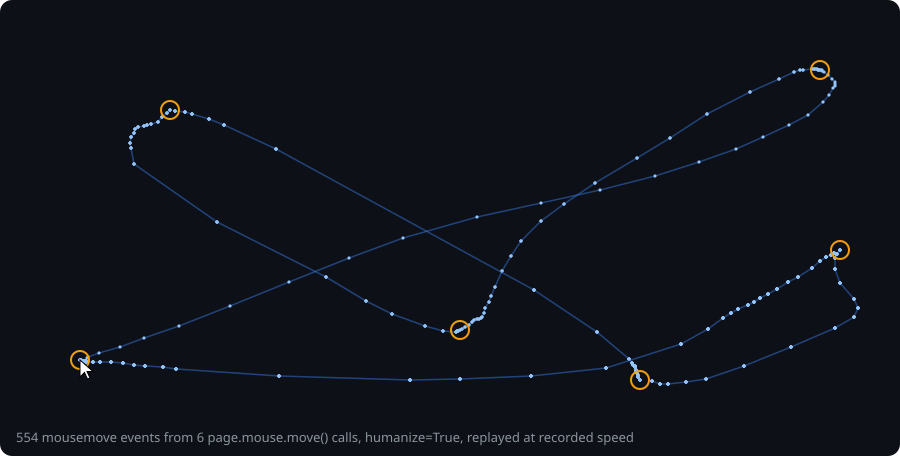
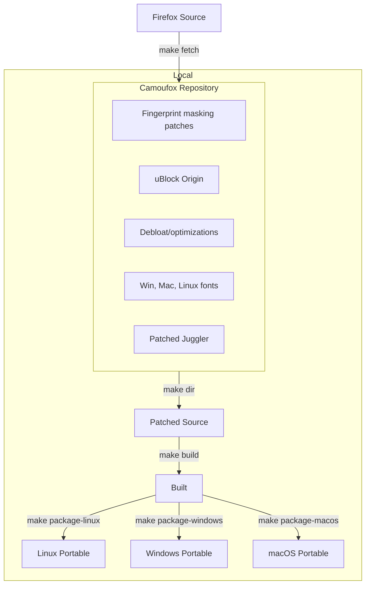
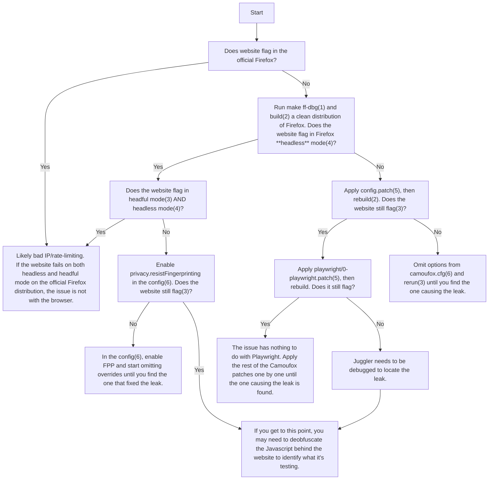

<h1 align="center">Camoufox</h1>

<h4 align="center">Camoufox is an open source anti-detect browser built for webscraping & AI agents. 🦊</h4>

<div align="center">
  <a href="https://trendshift.io/repositories/12224" target="_blank">
    
  </a><br>
  <a href="https://pepy.tech/projects/camoufox">
  <a href="https://pepy.tech/projects/camoufox"></a>
    <a href="https://pepy.tech/projects/camoufox"></a>
<h4>⚠️ This project is under development. It may not be suitable for stable production use. ⚠️</h4>
</div>

---

> [!NOTE]
> **All of the latest documentation is available at [camoufox.com](https://camoufox.com).**

---

# Sponsors

<details open id="sponsors">
<summary>View/Collapse All</summary>

## Premium

<table>
  <tr>
    <td width="25%" align="center" valign="middle">
      <a href="https://go.nodemaven.com/camoufoxghsept" target="_blank">
        
      </a>
    </td>
    <td valign="middle">
      <a href="https://go.nodemaven.com/camoufoxghsept">NodeMaven</a>: The most efficient proxy provider for Web Scrapping and Automation with the Highest Quality IP on the market.<br>
      <strong>Why <a href="https://go.nodemaven.com/camoufoxghsept">NodeMaven</a>?</strong><br>
      • 99.9% uptime<br>
      • ZIP Targeting<br>
      • IP filtering: all proxies have fraud score <97%<br>
      • No KYC required<br>
      • Unique free tools: Proxy Bandwidth Checker, Meta Tag Checker, IP Lookup and others!<br>
      <strong>Special codes for Camoufox users:</strong><br>
      • <code>CAMOUFOX35</code> - 35% off to Mobile and Residential Proxies<br>
      • <code>CAMOUFOX40</code> - 40% off to ISP (Static) Proxies<br>
    </td>
  </tr>
  <tr>
    <td width="25%" align="center" valign="middle">
      <a href="https://node-proxy.com" target="_blank">
        
      </a>
    </td>
    <td valign="middle">
      <strong>Need proxies for Camoufox?</strong><br>
      Use <strong><a href="https://node-proxy.com">Node Proxy</a></strong> — a provider of <strong>datacenter, residential and mobile proxies</strong> offering high speed, security and near-100% uptime. <strong>Fully tested and supported in Camoufox.</strong><br>
      <strong>What sets them apart from other providers</strong><br>
      • 90+ IP score<br>
      • HTTP + SOCKS5 — multiprotocol support<br>
      • Discounts for retail customers<br>
      • Full B2B support<br>
      • Ethically sourced IP addresses<br>
      • Special terms for Enterprise clients<br>
     <strong>Want to support Camoufox?</strong><br>
     Just use my promo code <strong><code>CAMOUFOX</code></strong> — it gets you a <strong>30% discount</strong> and supports the developer at the same time.<br>
     <strong><a href="https://node-proxy.com">Get started at node-proxy.com →</a></strong>
    </td>
  </tr>
  <tr>
    <td width="25%" align="center" valign="middle">
      <a href="https://byteful.com/?utm_source=github&utm_medium=github-sponsor&utm_campaign=camoufox_github_website_sponsor" target="_blank">
        
      </a>
    </td>
    <td valign="middle">
      <a href="https://byteful.com/?utm_source=github&utm_medium=github-sponsor&utm_campaign=camoufox_github_website_sponsor">Byteful</a> is a UK-based web data infrastructure platform that provides ethically sourced residential, mobile, static residential (ISP) and datacenter proxies alongside API-first tools for web scraping, data collection, and AI-driven automation.

Processing tens of billions of requests per month for thousands of customers, Byteful powers browser-based AI agents, automation systems, and data workflows. It is a member of the Internet Watch Foundation and the Ethical Web Data Collection Initiative.

Get 10% off Byteful Residential Proxies with the code: CAMOUFOX10
    </td>
  </tr>
  <tr>
    <td width="25%" align="center" valign="middle">
      <a href="https://layer3intel.com/?utm_source=github&utm_medium=sponsoring&utm_campaign=camoufox" target="_blank">
        
      </a>
    </td>
    <td valign="middle">
      <strong><a href="https://layer3intel.com/?utm_source=github&utm_medium=sponsoring&utm_campaign=camoufox">Layer3 Intel</a> | See your proxies the way anti-bots see them</strong><br>
      Camoufox hides your browser. Your proxy IP is the part it can't hide. Layer3 Intel is the residential proxy detection engine used to catch proxy traffic — check whether the IPs your provider sells you are clean, or already known and flagged.<br>
      • 🔍 Live threat score for any IP<br>
      • 🗂️ Proxy pool membership - identify IP resellers<br>
      • 📡 70M+ residential, mobile & ISP proxy IPs tracked across 200+ providers<br>
      • ⚡ <40ms API responses — vet IPs inline before your scraper uses them<br>
      Check your IPs: <a href="https://layer3intel.com/?utm_source=github&utm_medium=sponsoring&utm_campaign=camoufox">https://layer3intel.com</a>
    </td>
  </tr>
</table>

## Tools & Services
  
<table>
  <tr>
    <td width="25%" align="center" valign="middle">
      <a href="https://scrapfly.io/?utm_source=github&utm_medium=sponsoring&utm_campaign=camoufox" target="_blank">
        
      </a>
    </td>
    <td valign="middle">
      <a href="https://scrapfly.io/?utm_source=github&utm_medium=sponsoring&utm_campaign=camoufox">Scrapfly</a> is an enterprise-grade solution providing Web Scraping API that aims to simplify the scraping process by managing everything: real browser rendering, rotating proxies, and fingerprints (TLS, HTTP, browser) to bypass all major anti-bots. Scrapfly also unlocks the observability by providing an analytical dashboard and measuring the success rate/block rate in detail.
    </td>
  </tr>
  <tr>
    <td width="25%" align="center" valign="middle">
      <a href="https://cloverlabs.ai/?utm_source=github&utm_medium=sponsoring&utm_campaign=camoufox" target="_blank">
        
      </a>
    </td>
    <td valign="middle">
      <a href="https://cloverlabs.ai/?utm_source=github&utm_medium=sponsoring&utm_campaign=camoufox">Clover Labs</a> is a Toronto based venture studio building AI agents for growth and distribution.
    </td>
  </tr>
  <tr>
    <td width="25%" align="center" valign="middle" height="100">
      <a href="https://serpapi.com/use-cases/web-search-api?utm_source=camoufox" target="_blank">
        
      </a>
    </td>
    <td valign="middle">
      <a href="https://serpapi.com/use-cases/web-search-api?utm_source=camoufox">SerpApi, a web search API</a> to scrape Google and other search engines with a simple API.
    </td>
  </tr>
  <tr>
    <td width="25%" align="center" valign="middle" height="100">
      <a href="https://crawlbase.com/?utm_source=github&utm_medium=sponsorship&utm_campaign=camoufox" target="_blank">
        
      </a>
    </td>
    <td valign="middle">
      <strong>Web data that survives the anti-bots.</strong><br>
      <a href="https://crawlbase.com/?utm_source=github&utm_medium=sponsorship&utm_campaign=camoufox">Crawlbase</a> gives developers and AI teams reliable data at scale: a 99% success-rate Crawler, Crawling API, Smart AI Proxies, and Web MCP Server that get through, so your scrapers and agents don't break. You build, we handle the infrastructure.

<strong>Get 15% off your first 3 months with code CAMOUFOX</strong> → <a href="https://crawlbase.com/?utm_source=github&utm_medium=sponsorship&utm_campaign=camoufox">crawlbase.com</a>
    </td>
  </tr>
  <tr>
    <td width="25%" align="center" valign="middle">
      <a href="https://scrappey.com/?utm_source=camoufox&utm_medium=sponsorship&utm_campaign=camoufox_sponsorship" target="_blank">
        
      </a>
    </td>
    <td valign="middle">
      <a href="https://scrappey.com/?utm_source=camoufox&utm_medium=sponsorship&utm_campaign=camoufox_sponsorship">Scrappey</a> is a Web Scraping API that only charges successful scrapes with pay as you go - no subscriptions. Scrape complex sites. Residential proxies included, no hidden proxy fees, or expiring balances. One API for direct HTTP, full-browser rendering, JavaScript-heavy pages, screenshots, sessions, 30+ browser actions and 200+ concurrent sessions at a time - trusted by 1000+ developers and AI agents. Get 10% off with code CAMOUFOX.
    </td>
  </tr>
  <tr>
    <td width="25%" align="center" valign="middle">
      <a href="https://cloro.dev/?utm_source=referral&utm_medium=camoufox" target="_blank">
        
      </a>
    </td>
    <td valign="middle">
      <a href="https://cloro.dev/?utm_source=referral&utm_medium=camoufox">Cloro</a> is a SERP and AI search API. Get structured results from Google, ChatGPT, Perplexity, Gemini, Copilot and Grok.
    </td>
  </tr>
</table>

## Proxy Providers

Camoufox is intended to be used with rotating proxies (preferably residential IPs). Check out these providers:

<table>
  <tr>
    <td width="25%" align="center" valign="middle">
      <a href="https://proxyempire.io/?ref=camoufox&utm_source=github&utm_medium=paid_referral&utm_campaign=open_source_sponsorship&utm_content=camoufox" target="_blank">
        
      </a>
    </td>
    <td valign="middle">
      <b>🚀 Camoufox × ProxyEmpire</b><br>
      Running Camoufox? Your proxy layer decides whether you scale — or get blocked.<br>
      <a href="https://proxyempire.io/?ref=camoufox&utm_source=github&utm_medium=paid_referral&utm_campaign=open_source_sponsorship&utm_content=camoufox">ProxyEmpire</a> delivers:<br>
      • 🌍 30M+ Residential IPs (170+ countries)<br>
      • 📱 4G/5G Mobile Proxies<br>
      • 🔄 Rotating & Sticky Sessions<br>
      • ⚡ Unlimited Concurrent Sessions<br>
      • 🎯 Precise geo-targeting<br>
      • HTTP, HTTPS & SOCKS5 Support<br>
      Built for scraping, automation, and high-stealth workflows.<br>
      <b>🔥 Exclusive Offer</b> - Use code <b>Camoufox30</b><br>
      Get <b>30% recurring discount</b> (not just first month). Upgrade your proxies. Reduce bans. Scale properly
    </td>
  </tr>
  <tr>
    <td width="25%" align="center" valign="middle">
      <a href="https://www.rapidproxy.io/?ref=daijro" target="_blank">
        
      </a>
    </td>
    <td valign="middle">
      <a href="https://www.rapidproxy.io/?ref=daijro">RapidProxy</a> - Power Your Data with Premium Proxies.<br>
      🎁 Try proxies for free  + Use code <strong>RAPID10</strong> for <strong>10% OFF</strong>
      <br>
      <strong>Why Choose RapidProxy?</strong><br>
      • 🌍 90M+ IPs in 200+ countries & regions<br>
      • ♾️ No expiration on traffic — use anytime, no pressure<br>
      • 🔥 Unlimited concurrency for maximum performance<br>
      • 💰 Starting from just &#36;0.65/GB — built for scale<br>
      • 📍 City-level targeting for precise geo access<br>
      • 🔄 Flexible session control tailored to your needs<br>
      Don’t miss out — start your free trial today and experience fast, stable, and scalable proxy performance with <a href="https://www.rapidproxy.io/?ref=daijro">RapidProxy</a>.
    </td>
  </tr>
  <tr>
    <td width="25%" align="center" valign="middle">
      <a href="https://www.swiftproxy.net/?ref=daijro" target="_blank">
        
      </a>
    </td>
    <td valign="middle">
      <a href="https://www.swiftproxy.net/?ref=daijro">Swiftproxy</a> - <strong>High-Performance Residential Proxies for Scalable Data Collection</strong><br>
      Built for developers who need <strong>reliable</strong>, anti-detection proxy infrastructure. Swiftproxy delivers stable connections, high success rates, and flexible control for large-scale scraping and automation.<br>
      • 🌍 195+ locations with ethically sourced residential IPs<br>
      • 🔄 <strong>Rotating</strong> & <strong>sticky</strong> sessions with precise geo-targeting<br>
      • ⚡ Optimized for <strong>anti-ban</strong> & <strong>high success rate</strong><br>
      • 🔌 HTTP / HTTPS / SOCKS5 support<br>
      • 🧪 <strong>Free 500MB trial</strong> for testing<br>
      • 💸 <strong>Special discount</strong> code for Camoufox users: <strong>PROXY90 - 10%</strong><br>
      Best for: Web scraping, automation, multi-accounting, and large-scale data extraction
    </td>
  </tr>     
  <tr>
    <td width="25%" align="center" valign="middle">
      <a href="https://mangoproxy.com/?utm_source=github&utm_medium=partner&utm_campaign=daijro" target="_blank">
        
      </a>
    </td>
    <td valign="middle">
      <a href="https://mangoproxy.com/?utm_source=github&utm_medium=partner&utm_campaign=daijro">MangoProxy</a> is a Residential, ISP, Mobile and Datacenter proxy service designed for professional tasks where stability, speed, and anonymity matter.<br>
      Use code DAIJRO for 8% OFF ISP Static Proxies
    </td>
  </tr>
  <tr>
    <td width="25%" align="center" valign="middle">
      <a href="https://proxidize.com/?utm_source=github&utm_medium=sponsorship&utm_campaign=camoufox&utm_content=daijro" target="_blank">
        
      </a>
    </td>
    <td valign="middle">
      <strong><a href="https://proxidize.com/?utm_source=github&utm_medium=sponsorship&utm_campaign=camoufox&utm_content=daijro">Proxidize</a> | Mobile and Residential Proxies for Camoufox</strong><br>
      Running Camoufox at scale? Your browser setup is only half the stack. Your proxy layer matters too.<br>
      Proxidize provides mobile and residential proxies built for scraping, browser automation, SEO monitoring, AI agents, and data collection workflows.<br>
      <strong>Why Proxidize?</strong><br>
      • Real 4G and 5G mobile proxies<br>
      • Residential proxies in 195+ countries<br>
      • Rotating and sticky sessions<br>
      • City-level and carrier targeting<br>
      • Unlimited concurrency<br>
      • HTTP(S), SOCKS5, and UDP over SOCKS support<br>
      • No hardware or DIY setup required<br>
      Built for teams that need reliable proxy infrastructure without managing devices, servers, or proxy rotation themselves.<br>
      <strong>Special offer for Camoufox users</strong>: Use code <strong>CAMOUFOX20</strong> for <strong>20% off</strong>.<br>
      Start now: <a href="https://proxidize.com/?utm_source=github&utm_medium=sponsorship&utm_campaign=camoufox&utm_content=daijro">https://proxidize.com</a>
    </td>
  </tr>
  <tr>
    <td width="25%" align="center" valign="middle">
      <a href="https://niuproxy.com/?utm_source=camoufox&utm_medium=camoufox&ref=camoufox" target="_blank">
        
      </a>
    </td>
    <td valign="middle">
      <strong><a href="https://niuproxy.com/?utm_source=camoufox&utm_medium=camoufox&ref=camoufox">NiuProxy</a> | Rotating Residential Proxies from &#36;0.35/GB<br></strong>
      NiuProxy provides residential, ISP, mobile, and datacenter proxies for scraping, browser automation, SEO, AI agents, and data collection.<br>
      <strong>Why NiuProxy?</strong><br>
      • Residential proxies from &#36;0.35/GB<br>
      • ISP proxies from &#36;3/IP<br>
      • Mobile proxies from &#36;1.5/GB<br>
      • Datacenter proxies from &#36;0.5/GB<br>
      • HTTP(S) & SOCKS5 support<br>
      • Flexible geo targeting and sessions<br>
      • Alipay, USDT, cards, Google Pay & Apple Pay<br>
      Special offer for Camoufox users: Use code PAY2 for 10% off your recharge.<br>
      Start now: <a href="https://niuproxy.com/?utm_source=camoufox&utm_medium=camoufox&ref=camoufox">https://niuproxy.com</a>
    </td>
  </tr>
  <tr>
    <td width="25%" align="center" valign="middle">
      <a href="https://www.thordata.com/?ls=dcx&lk=dcx" target="_blank">
        
      </a>
    </td>
    <td valign="middle">
      <b>🔍 Camoufox × Thordata</b><br>
      <b>Real Residential IPs for Smarter AI Agents & Automation</b><br>
      With <strong>100M+ residential IPs</strong>, Thordata helps your scraper access the web through real user IPs across <strong>195+ countries</strong>.<br>
      Target specific locations with precision — including <strong>city, ISP, and ASN-level targeting</strong> — so your Camoufox automation runs with a more authentic network identity.<br>
      • 🔄 <strong>Rotating & Sticky Sessions</strong> (up to 90 minutes)<br>
      • ⚡ <strong>99.99% uptime</strong> with unlimited concurrent sessions<br>
      • 🌍 <strong>Global residential coverage</strong> for AI agents, scraping, and automation workflows<br>
      🎁 <strong>Exclusive for Camoufox users:</strong><br>
      Get free trial traffic after signup + use code <strong>Camoufox</strong> for <strong>10% OFF</strong>.<br>
      <a href="https://www.thordata.com/?ls=dcx&lk=dcx" target="_blank">Start your free trial with Thordata</a>
  </tr>
  <tr>
    <td width="25%" align="center" valign="middle">
      <a href="https://www.webshare.io/" target="_blank">
        
      </a>
    </td>
    <td valign="middle">
      <strong><a href="https://www.webshare.io/">Webshare</a></strong> gives you instant access to a proxy pool of 80M+ ethically-sourced IPs across 195+ countries, with rotating residential, static ISP, and datacenter options plus a full API. It includes a 100+ Gbps backbone, country/city/state/ZIP/ASN-level targeting, and requires no credit card to start.<br>
      🏷️ Get <strong>20% OFF your first purchase</strong> with promo code <strong><code>CAMOUFOX20</code></strong>
  </tr>
  <tr>
    <td width="25%" align="center" valign="middle">
      <a href="https://roamproxy.com" target="_blank">
        
      </a>
    </td>
    <td valign="middle">
      <strong><a href="https://roamproxy.com">Roam</a></strong> — Residential & static residential proxies, pay-as-you-go per GB. Use code CAMOUFOX15 for 15% extra credit on your first top-up.
  </tr>
</table>
</details>

---

# Introduction

Camoufox is a Firefox fork engineered for web scraping and AI agents. It is headless, undetectable, and optimized to run at scale. Every run gets a fresh identity drawn from the real-world distribution of devices, so it blends into normal traffic instead of standing out.

## Highlights

* **Built for AI agents** 🤖
  * Minimal, debloated Firefox - fast to launch, cheap to run
  * Drop-in Playwright compatibility via Python interface
  * Invisible to anti-bot systems so you can run your agent cluster locally or in the cloud without being flagged

- **Undetectable by design** 🎭
  - Page automation hidden from JavaScript inspection. See the [stealth page](https://camoufox.com/stealth) for more details.

* **Fingerprint injection & rotation (without JS injection!)**
  * All navigator properties (device, OS, hardware, browser, etc.) ✅
  * Screen size, resolution, window, & viewport properties ✅
  * Geolocation, timezone, locale, & Intl spoofing ✅
  * WebRTC IP spoofing at the protocol level ✅
  * Voices, speech playback rate, etc. ✅
  * And much, much more!

- **Anti Graphical fingerprinting**
  - WebGL parameters, supported extensions, context attributes, & shader precision formats ✅
  - Font spoofing & anti-fingerprinting ✅

* **Optimized for automation**
  * Human-like mouse movement 🖱️
  * Blocks & circumvents ads 🛡️
  * Optional instant animations (`instantAnimations`), so Playwright never waits on one 💨

- Debloated & optimized for memory efficiency ⚡
- [PyPI package](https://pypi.org/project/camoufox/) for updates & auto fingerprint injection 📦
- Stays up to date with the latest Firefox version 🕓

---

## Fingerprint Injection

In Camoufox, data is intercepted at the C++ implementation level, making the changes undetectable through JavaScript inspection.

To spoof individual fingerprint properties, pass a JSON containing properties to spoof to the [Python interface](pythonlib/):

```py
>>> with Camoufox(config={"property": "value"}) as browser:
```

Config data not set by the user is populated from [fpgen](https://github.com/scrapfly/fingerprint-generator), a model of the statistical distribution of device characteristics in real-world traffic. The assembled identity is then checked for coherence, so parts that are each plausible cannot combine into a machine that does not exist.

[[See implemented properties](https://camoufox.com/fingerprint/)]

---

## Python Usage

Camoufox is compatible with your existing Playwright code. You only have to change your browser initialization.

**Sync API**

```python
from camoufox.sync_api import Camoufox

with Camoufox() as browser:
    page = browser.new_page()
    page.goto("https://example.com")
```

**Async API**

```python
from camoufox.async_api import AsyncCamoufox

async with AsyncCamoufox() as browser:
    page = await browser.new_page()
    await page.goto("https://example.com")
```

[[Installation & usage](https://camoufox.com/python/)]

---

## Capabilities

Below is a list of patches and features implemented in Camoufox.

### Fingerprint spoofing

- Navigator properties spoofing (device, browser, locale, etc.)
- Support for emulating screen size, resolution, etc.
- Spoof WebGL parameters, supported extensions, context attributes, and shader precision formats.
- Spoof inner and outer window viewport sizes
- Spoof AudioContext sample rate, output latency, and max channel count
- Spoof device voices & playback rates
- Spoof the amount of microphones, webcams, and speakers available.
- Network headers (Accept-Languages and User-Agent) are spoofed to match the navigator properties
- WebRTC IP spoofing at the protocol level
- Geolocation, timezone, and locale spoofing
- etc.

### Stealth patches

- Avoids main world execution leaks. All page agent javascript is sandboxed
- Avoids frame execution context leaks
- Fixes `navigator.webdriver` detection
- Fixes Firefox headless detection via pointer type ([#26](https://github.com/daijro/camoufox/issues/26))
- Removed potentially leaking anti-zoom/meta viewport handling patches
- Uses non-default screen & window sizes
- Re-enable fission content isolations
- Re-enable PDF.js
- Other leaking config properties changed
- Human-like cursor movement

### Anti font fingerprinting

- Automatically uses the correct system fonts for your User Agent
- Bundled with Windows, Mac, and Linux system fonts
- No glyph-spacing noise: measured text widths are the ones the same font gives on a real machine

### Playwright support

- Custom implementation of Playwright for the latest Firefox
- Various config patches to evade bot detection

### Debloat/Optimizations

- Stripped out/disabled _many, many_ Mozilla services. Runs faster than the original Mozilla Firefox, and uses less memory (200mb)
- Patches from LibreWolf & Ghostery to help remove telemetry & bloat
- Debloat config from PeskyFox, LibreWolf, and others
- Speed & network optimizations from FastFox
- Animations run on stock timing; `instantAnimations: True` finishes them at once, at the cost of being detectable
- Minimalistic theming
- etc.

### Addons

- Load Firefox addons without a debug server by passing a list of paths to the `addons` property
- Added uBlock Origin with custom privacy filters
- Addons are not allowed to open tabs
- Addons are automatically enabled in Private Browsing mode
- Addons are automatically pinned to the toolbar
- Fixes DNS leaks with uBO prefetching

### Python Interface

- Automatically generates & injects unique device characteristics into Camoufox based on their real-world distribution
- WebGL fingerprint injection & rotation
- Uses the correct system fonts and subpixel antialiasing & hinting based on your target OS
- Avoid proxy detection by calculating your target geolocation, timezone, & locale from your proxy's target region
- Calculate and spoof the browser's language based on the distribution of language speakers in the proxy's target region
- Remote server hosting to use Camoufox with other languages that support Playwright
- Built-in virtual display buffer to run Camoufox headfully on a headless server
- Toggle image loading, WebRTC, and WebGL
- etc.

> [!NOTE]
> Camoufox does **not** fully support injecting Chromium fingerprints. Some WAFs (such as [Interstitial](https://nopecha.com/demo/cloudflare)) test for Spidermonkey engine behavior, which is impossible to spoof.

---

# Stealth Overview

## How Camoufox hides its automation library

In Camoufox, all of Playwright's internal Page Agent's code is sandboxed and isolated. This makes it impossible for a page to detect the presence of Playwright through Javascript inspection.

Normally, Playwright injects some JavaScript into the page such as `window.__playwright__binding__` and to perform actions like querying elements, evaluating javascript, or running init scripts, which can be detected by websites. In Camoufox, these actions are handled in an isolated scope outside of the page. In other words, websites can no longer "see" any JavaScript that Playwright would typically inject. This prevents traces of Playwright altogether.

However, even with hiding its automation library, Camoufox is not immune to inconsistencies in fingerprint rotation. This still requires maintenance to spot and fix.

### Page Interactions

Anti-bot systems also run client-side scripts to monitor your behavior. For example, they look for patterns in mouse movements, clicks, scrolling, and the timing between actions.



Every dot above is a `mousemove` event the page received from six `page.mouse.move()` calls, replayed at the speed it arrived. Close dots mean the hand slowed down. `scripts/cursor-demo.py` regenerates the figure from a build.

Camoufox does not draw its cursor paths. With `humanize=True` it uses [**Cursory**](https://github.com/Vinyzu/cursory) by [Vinyzu](https://github.com/Vinyzu), which holds 2357 mouse movements recorded from real people: it picks a recording whose direction, distance and wander suit the move being made, morphs it onto the requested start and end points, and replays it with that recording's own timing — pauses, overshoots and all.

That last part matters as much as the shape. Camoufox previously walked a Bézier curve through two random knots and emitted a point every 10ms. Both halves of that are tells: an analytic curve sampled at a fixed rate has velocity and jerk profiles that separate cleanly from a hand's, and the acceleration came entirely from one easing function, so every movement Camoufox ever made sped up and slowed down the same way. A replayed recording has neither property.

Camoufox ships [cursory-js](https://github.com/JWriter20/cursory-js), a TypeScript port of Cursory, vendored into Juggler at `additions/juggler/input/cursory/`. It reproduces the Python original bit for bit, so a path can be reproduced against `pip install cursory`. **Cursory is LGPLv3-or-later, not MPL-2.0 like the rest of the browser**; its licence and full provenance are in `additions/juggler/input/cursory/NOTICE`.

However, this isn't perfect. It may still be detected with sophisticated enough analysis. (WIP for the future)

---

## How Camoufox rotates identities

AI agents need to operate across many sessions without getting flagged or rate-limited. Rotating your IP address isn't enough — every browser session carries thousands of signals that create a unique **fingerprint**. A website can see your OS, GPU, screen resolution, fonts, timezone, and more. If those signals are inconsistent or unusual, you get blocked.

### Market Share Distribution

Even if you are rotating your IP for each running bot instance, web access firewalls can still use machine learning to analyze incoming web traffic to detect if it's abnormal. If the Linux market share was 5%, then suddenly it's 20%, it's a red flag. They will unconditionally require all Linux users to complete a captcha.

Camoufox draws identities from [fpgen](https://github.com/scrapfly/fingerprint-generator), a Bayesian network trained on live traffic, so each device characteristic appears about as often as it does in the real world, and in the combinations real devices produce.

### How can Camoufox be detected?

Camoufox can spoof fingerprints with a correct market share. However, **fingerprints must also be internally consistent.** A Windows user agent with an Apple M1 GPU, a MacOS user agent with a Windows DirectX renderer, and a mobile device with a desktop screen resolution are all impossible, and will be flagged for being suspicious.

Every drawn identity passes a coherence check (`pythonlib/camoufox/coherence.py`) that rejects impossible combinations before launch. But of the thousands of datapoints that must agree with each other, Camoufox doesn't always get every one right. Anti-bot providers test Camoufox over and over again to find even 1 unique inconsistency, then they immediately update their background scripts to test for it.

---

## How does Camoufox compare to other solutions?

### JavaScript-based solutions

In the past, developers tried injecting JavaScript to spoof these values, but it doesn't work reliably since JavaScript can't spoof everything. Incomplete coverage causes inconsistent fingerprints. For example, an anti-bot system will flag you if your network request's User Agent doesn't match your navigator's User Agent.

Additionally, all injected JavaScript is detectable in some way. Anti-bot systems can check if `Object.getOwnPropertyDescriptor` reveals an overwritten property, if a function's `toString()` no longer returns `[native code]` (revealing it was hijacked), or if data in the window context doesn't match the worker thread context. Workarounds only take you so far, but there will always be a way to detect JS injection if you search deep enough.

#### Camoufox's approach

Since Camoufox intercepts calls in the browser's C++ implementation level, all of the hijacked objects and properties appear native. There is no JavaScript hijacking to be detected.

Camoufox also generates consistent and believable fingerprints with fpgen and its coherence check. However, this can still be detected by complex fingerprint detection methods like mismatching data (as described earlier).

<hr width=50>

### CDP-based libraries

CDP (Chrome DevTools Protocol) is an automation protocol built into Chromium and Firefox. However, CDP makes no effort to hide the fact that it's an automation protocol and exposes much of its functionality in the page scope. Some common methods are checking if `navigator.webdriver` is true, catching it reading the stack debugger, checking for variables that ChromeDriver injects into the document object for internal communication, and more.

#### Camoufox's approach

While Playwright uses CDP to control Chromium, it uses _Juggler_ for Firefox. Juggler is a custom protocol developed before Firefox supported CDP ([original repo](https://github.com/puppeteer/juggler)). It is a distinct module within Firefox, and not part of its core browser. This makes it easier to edit and control what's revealed to the page.

Camoufox patches Juggler to give it its own isolated "copy" of the page to work with. Playwright can read and edit its own version of the page freely. Everything appears to work normally to it, but the real page is completely unaffected by these changes. The page also can't detect when things are being read (through tricks like hijacking getters) or listeners being added to watch elements.

Additionally, Juggler sends its inputs directly through the Firefox's original user input handlers, meaning they are handled the exact same way as if you were using the browser normally. Camoufox also patches Firefox's headless mode to appear the same as if it were running in a normal window. But as a fallback, the Python library can run Camoufox in a [virtual display](https://camoufox.com/python/virtual-display/) if headless mode ever leaks.

---

<h1 align="center">Build System</h1>

> [!WARNING]
> The content below is intended for those interested in building & debugging Camoufox. For usage instructions, see [pythonlib](pythonlib/).

### Overview

Here is a diagram of the build system, and its associated make commands:



This was originally based on the LibreWolf build system.

## Build CLI

> [!WARNING]
> Camoufox's build system is designed to be used in Linux. WSL will not work!

First, clone this repository with Git:

```bash
git clone --depth 1 https://github.com/daijro/camoufox
cd camoufox
```

Next, build the Camoufox source code with the following command:

```bash
make dir
```

Before bootstrapping, install the system build dependencies with the helper
script. It detects your platform and installs everything the build needs
(Python ≥ 3.11, Rust, `aria2`, `p7zip`, `msitools`, `wget`, `sqlite`, and
the core build tools) using the appropriate package manager — Homebrew on macOS,
or `apt`/`dnf`/`pacman` on Linux:

```bash
bash scripts/install-deps.sh
```

> [!NOTE]
> The dependency installer has so far only been tested on macOS.

After that, you have to bootstrap your system to be able to build Camoufox. You only have to do this one time. It is done by running the following command:

```bash
make bootstrap
```

Finally you can build and package Camoufox the following command:

```bash
python3 multibuild.py --target linux windows macos --arch x86_64 arm64 i686
```

For new builds, `i686` is supported only for Windows. Unsupported target/architecture combinations are skipped.

<details>
<summary>
CLI Parameters
</summary>

```bash
Options:
  -h, --help            show this help message and exit
  --target {linux,windows,macos} [{linux,windows,macos} ...]
                        Target platforms to build
  --arch {x86_64,arm64,i686} [{x86_64,arm64,i686} ...]
                        Target architectures to build for each platform
  --bootstrap           Bootstrap the build system
  --clean               Clean the build directory before starting

Example:
$ python3 multibuild.py --target linux windows macos --arch x86_64 arm64
```

</details>

### Using Docker

Camoufox can be built through Docker on all platforms.

1. Create the Docker image containing Firefox's source code:

```bash
docker build -t camoufox-builder .
```

2. Build Camoufox patches to a target platform and architecture:

```bash
docker run -v "$(pwd)/dist:/app/dist" camoufox-builder --target <os> --arch <arch>
```

<details>
<summary>
How can I use my local ~/.mozbuild directory?
</summary>

If you want to use the host's .mozbuild directory, you can use the following command instead to run the docker:

```bash
docker run \
  -v "$HOME/.mozbuild":/root/.mozbuild:rw,z \
  -v "$(pwd)/dist:/app/dist" \
  camoufox-builder \
  --target <os> \
  --arch <arch>
```

</details>

<details>
<summary>
Docker CLI Parameters
</summary>

```bash
Options:
  -h, --help            show this help message and exit
  --target {linux,windows,macos} [{linux,windows,macos} ...]
                        Target platforms to build
  --arch {x86_64,arm64,i686} [{x86_64,arm64,i686} ...]
                        Target architectures to build for each platform
  --bootstrap           Bootstrap the build system
  --clean               Clean the build directory before starting

Example:
$ docker run -v "$(pwd)/dist:/app/dist" camoufox-builder --target windows macos linux --arch x86_64 arm64 i686
```

</details>

Build artifacts will now appear written under the `dist/` folder.

---

## Working on patches

`make dir` leaves `camoufox-<version>-<release>/` as a git repository with every patch applied. A patch is a diff against a checkpoint in that repository:

```bash
# A new patch
make dir                 # apply every existing patch
make first-checkpoint    # mark the starting point
# ...edit files in camoufox-*/, test with `make build` and `make run`...
make diff > patches/my-change.patch

# An existing patch
make dir
make workspace ./patches/x.patch   # unapply x, checkpoint, reapply x
# ...edit...
make diff > patches/x.patch
```

`make diff` shows only tracked files, so `git add -N <file>` any new file first. `make workspace` needs every later patch to leave the hunks of `x.patch` alone. `make patch` and `make unpatch` apply or reverse one patch, and `make revert` resets the tree to unpatched Firefox.

Then run the suites that cover what you changed. [`CONTRIBUTING.md`](CONTRIBUTING.md) says which ones, and [`ci/README.md`](ci/README.md) has the whole pipeline.

---

## Leak Debugging

This is a flow chart demonstrating my process for determining leaks without deobfuscating WAF Javascript. The method incrementally reintroduces Camoufox's features into Firefox's source code until the testing site flags.

This process requires a Linux system and assumes you have Firefox build tools installed (see [here](https://github.com/daijro/camoufox?tab=readme-ov-file#build-cli)).

<details>
<summary>
See flow chart...
</summary>



#### Cited Commands

| #   | Command                                       | Description                                                                                                 |
| --- | --------------------------------------------- | ----------------------------------------------------------------------------------------------------------- |
| (1) | `make ff-dbg`                                 | Setup vanilla Firefox with minimal patches.                                                                 |
| (2) | `make build`                                  | Build the source code.                                                                                      |
| (3) | `make run`                                    | Runs the built browser.                                                                                     |
| (4) | `make run args="--headless https://test.com"` | Run a URL in headless mode. All redirects will be printed to the console to determine if the test passed.   |
| (5) | `make patch ./patches/<name>.patch`           | Apply one patch. `make unpatch` reverses it.                                                                |
| (6) | `make edit-cfg`                               | Edit camoufox.cfg in the default system editor.                                                             |

</details>

---

## Licensing

- **The browser** (`patches/`, `additions/`, `settings/`, and the build system) is [MPL-2.0](LICENSE), the licence of the Firefox source it modifies. The vendored Cursory trajectories are LGPLv3-or-later (`additions/juggler/input/cursory/NOTICE`).
- **The Python launcher** is MIT ([`pythonlib/LICENSE`](pythonlib/LICENSE)), as it has always been declared on PyPI.

---

## Thanks

Debloating & references:

- [LibreWolf](https://gitlab.com/librewolf-community/browser/source): Debloat patches & build system inspiration
- [BetterFox](https://github.com/yokoffing/BetterFox): Speed and debloat preferences
- [Ghostery](https://github.com/ghostery/user-agent-desktop): Debloat reference ([disable onboarding](https://github.com/daijro/camoufox/blob/main/patches/ghostery/Disable-Onboarding-Messages.patch))

Web scraping & testing:

- [Vinyzu/cursory](https://github.com/Vinyzu/cursory): The recorded human mouse trajectories behind `humanize=True`, vendored via [cursory-js](https://github.com/JWriter20/cursory-js) (LGPLv3-or-later — see `additions/juggler/input/cursory/NOTICE`)
- [riflosnake/HumanCursor](https://github.com/riflosnake/HumanCursor): The Bézier cursor algorithm Camoufox used before Cursory
- [scrapfly/fingerprint-generator](https://github.com/scrapfly/fingerprint-generator) (fpgen): The device distribution identities are drawn from
- [CreepJS](https://github.com/abrahamjuliot/creepjs), [Browserleaks](https://browserleaks.com), [BrowserScan](https://www.browserscan.net/) - Valuable leak testing sites

UI theming:

- [Jamir-boop/minimalisticfox](https://github.com/Jamir-boop/minimalisticfox): Inspired Camoufox's minimal css theming [(link)](https://github.com/daijro/camoufox/blob/main/settings/chrome.css)
